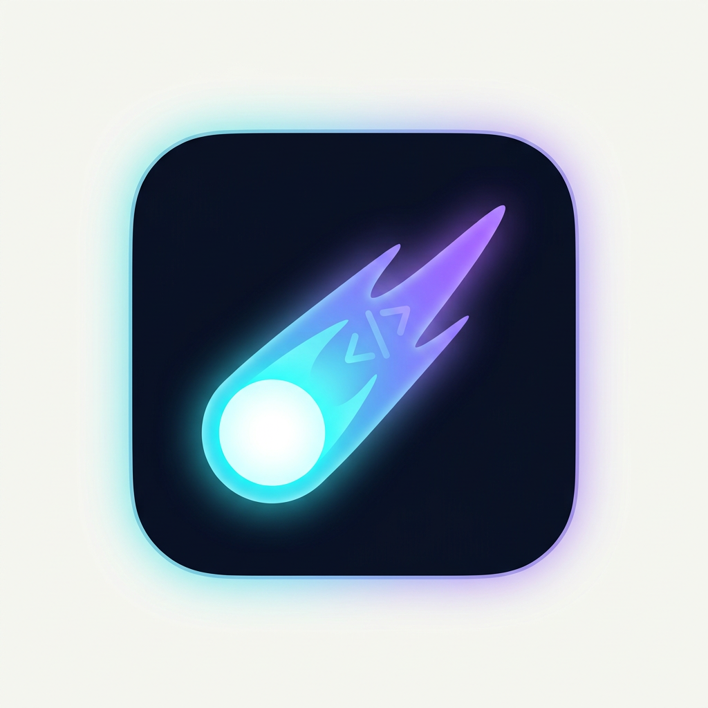

# 🌠 TinyIDE

**TinyIDE** — быстрая IDE в стиле VS Code на **Tauri 2 + Vue 3 + Monaco**, с анимированным курсором-кометой, поддержкой **90+ языков** и встроенным **компилятором Funo**.



## ✨ Возможности

- **🧩 WASM-плагины** — плагины в формате WebAssembly: один .wasm работает в десктопе (wasmi) и в браузере (нативный WASM). Менеджер плагинов, установка из папки, включение/отключение. [Маркет плагинов](https://tikhonneoplayneoplaydev.github.io/TinyIDE/plugins/)
- **🧩 Модуль Funo** — язык Funo (компилируется в Java/JVM): подсветка синтаксиса, автодополнение, hover-документация, проверка кода, транспиляция в Java, сборка `.jar` и запуск (встроенный Rust-компилятор)
- **🚀 Курсор-комета** — плавное скольжение, светящийся шлейф, аура и искры при наборе (всё настраивается)
- **📝 Редактор Monaco** — тот же движок, что в VS Code: автодополнение, подсветка синтаксиса 90+ языков, мини-карта, скобочные направляющие
- **📂 Проводник** — дерево файлов с контекстным меню (создание, переименование, удаление), вкладки, dirty-индикаторы
- **🔍 Поиск по файлам** — мгновенный поиск с переходом к строке
- **🎨 Тема Tiny Dark / Light** — две фирменные темы + 6 акцентных цветов
- **⚙️ Полная кастомизация** — шрифты, лигатуры, курсор, скобки, эффекты кометы
- **🖼️ Фирменные логотипы** — у каждого из 100+ языков свой SVG-логотип (краб, змейки, дельфин, слон…). Логотип Rust — оригинальный Феррис © Rust Project (автор Karen Rustad Tölva, CC-BY 4.0, rustacean.net)
- **⌨️ Палитра команд** — как в VS Code: `Ctrl+Shift+P`, быстрое открытие `Ctrl+P`
- **💻 Терминал** — встроенный PTY-терминал (xterm.js + Rust): выбор оболочки **nu, pwsh, cmd, zsh, fish, shell**, Ctrl+`
- **▶️ Задачи** — команды из конфига (build / run / test…) с выводом в панель
- **⚙️ tinyide.toml** — абсолютная кастомизация файлом конфигурации в корне проекта: применяется при сохранении
- **🔀 Source Control** — git с любым провайдером (GitHub/GitLab/Bitbucket/Gitea): клонирование, pull/push/commit/init, ветка, ahead/behind
- **📋 Проблемы** — панель проблем (маркеры Monaco): ошибки/предупреждения с переходом к строке
- **🧭 Breadcrumbs и outline** — хлебные крошки и структура документа (из WASM-плагина)
- **🖥️ Нативный десктоп** — открывай любые папки на диске, редактируй и сохраняй файлы через Rust-команды Tauri
- **🌍 Сайт + веб-версия** — лендинг и онлайн-демо на GitHub Pages

## 🎯 Горячие клавиши

| Действие | Клавиши |
| --- | --- |
| Палитра команд | `Ctrl+Shift+P` / `F1` |
| Быстрое открытие файла | `Ctrl+P` |
| Сохранить | `Ctrl+S` |
| Закрыть вкладку | `Ctrl+W` |
| Сайдбар | `Ctrl+B` |
| Глобальный поиск | `Ctrl+Shift+F` |
| Размер шрифта | `Ctrl+=` / `Ctrl+-` |
| Сменить тему | кнопка в статус-баре |
| Терминал | `Ctrl+`` |
| Задачи | `Ctrl+Shift+P` → *Run task* |

## 🛠️ Разработка

Требуется: Node 20+, Rust (stable) и системные зависимости Tauri 2
([инструкция](https://tauri.app/start/prerequisites/)).

```bash
npm install

# браузерная версия
npm run dev

# десктоп-приложение (Tauri)
npm run tauri dev

# production-сборка
npm run build
```

## 💻 Терминал и задачи

- Открой панель клавишей `` Ctrl+` `` (или кнопкой в статус-баре)
- Выбери оболочку: **nu, pwsh, cmd, zsh, fish, shell** — терминал перезапустится в ней
- В десктоп-версии это настоящий PTY (крейт `portable-pty`), в веб-демо — симуляция с базовыми командами (`help`, `ls`, `pwd`, `echo`…)
- Вкладка **Задачи**: команды из `[commands]` конфига (`build`, `run`, `test`…) запускаются с выводом в панель; запустить можно и из палитры команд

## ⚙️ tinyide.toml — абсолютная кастомизация

Файл `tinyide.toml` в корне проекта переопределяет **все** настройки (применяется при сохранении):

```toml
[appearance]
theme = "dark"        # "dark" | "light"
accent = "cyan"       # "cyan" | "violet" | "pink" | "green" | "amber" | "red"

[editor]
font_family = "'JetBrains Mono', monospace"
font_size = 15
cursor_style = "block"
word_wrap = "on"
# …и все остальные параметры редактора

[effects]
trail = true
glow_intensity = 90

[terminal]
shell = "nu"          # "shell" | "nu" | "pwsh" | "cmd" | "zsh" | "fish"
font_size = 14

[commands]
build = "npm run build"
run = "npm run dev"
test = "npm test"
```

Открыть/создать файл: палитра команд → *Open Config (tinyide.toml)* или кнопка в Настройках.

## 📦 Релизы

GitHub Actions собирает установщики для всех платформ:

| Платформа | Формат |
| --- | --- |
| Windows | `TinyIDE_0.1.0_x64-setup.exe` (NSIS) |
| Linux | `.AppImage` и `.deb` |
| macOS | `.app` и `.dmg` |

- На тег `v*` (например `v0.1.0`) автоматически создаётся **GitHub Release** со всеми установщиками.
- Артефакты каждого билда — во вкладке **Actions → Build Desktop → Artifacts**.
- Браузерная версия деплоится на **GitHub Pages** (включить в Settings → Pages → Source: *GitHub Actions*).

## 🎛️ Кастомизация

В панели **Settings** (шестерёнка на панели активностей) настраивается всё:

- 🎨 **Тема и акцент** — тёмная/светлая + 6 акцентных цветов (перекрашивают весь интерфейс и редактор)
- ✍️ **Шрифт** — 8 семейств (JetBrains Mono, Fira Code, Cascadia Code…), размер, лигатуры, высота строки
- 📝 **Редактор** — табы/пробелы, перенос, миникарта, автозакрытие скобок, автодополнение, цветные скобки, направляющие, прилипающий скролл, зум, отступы
- ✏️ **Курсор** — стиль, мигание, ширина, плавное движение
- 🚀 **Эффекты кометы** — шлейф, свечение и искры с регулировкой интенсивности
- 📂 **Файлы** — показ скрытых файлов

## 🌍 Сайт и веб-версия

- **Лендинг**: `https://tikhonneoplayneoplaydev.github.io/TinyIDE/`
- **Онлайн-демо IDE**: `https://tikhonneoplayneoplaydev.github.io/TinyIDE/demo/`

Сборка: `npm run build:web` (демо в `dist/demo`), лендинг из `website/` копируется в корень `dist/`. Деплой — GitHub Pages (включить в Settings → Pages → Source: *GitHub Actions*).

## 📜 Лицензия: AGPL-3.0

Проект распространяется под **GNU Affero General Public License v3.0** — сильнейший copyleft:

- 🔓 **Код остаётся открытым навсегда** — любой форк, переработка или использование обязаны сохранять лицензию AGPL-3.0 и публиковать изменения.
- 🚫 **Нельзя закрыть** — корпорация не сможет взять код, закрыть его и переименовать (даже «поставить свой логотип»): производные работы обязаны оставаться открытыми под той же лицензией.
- 🌐 **Даже через сеть** — если модифицированная версия доступна пользователям как веб-сервис (SaaS), исходный код обязан предоставляться этим пользователям.
- 🤝 **Изменения наружу** — распространитель модифицированной версии обязан предоставить её исходный код.

Полный текст — в файле [`LICENSE`](LICENSE).

## 🧱 Архитектура

```
Vue 3 UI (проводник, вкладки, палитра, статус-бар)
        │
        ▼
Monaco Editor  ──  CursorFX (комета, шлейф, искры)
        │
        ▼
FileSystem bridge
   ├── Tauri (Rust-команды: list_dir, read_file, write_file, …)
   └── Virtual FS (пример проекта в браузере)
```

Настройки хранятся в `localStorage`, темы Monaco определены в `src/editor/monacoSetup.ts`.
